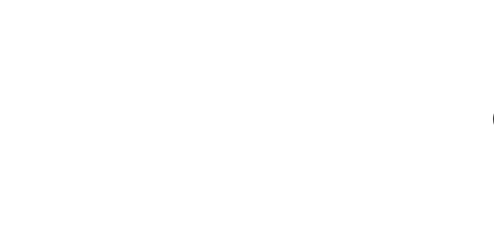
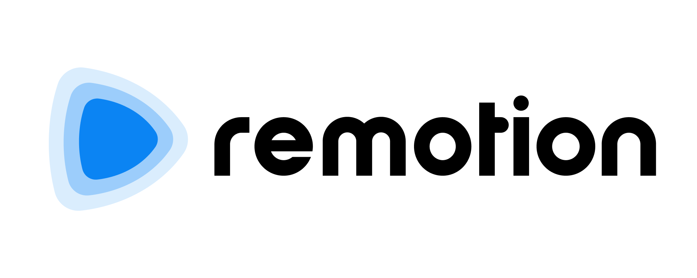
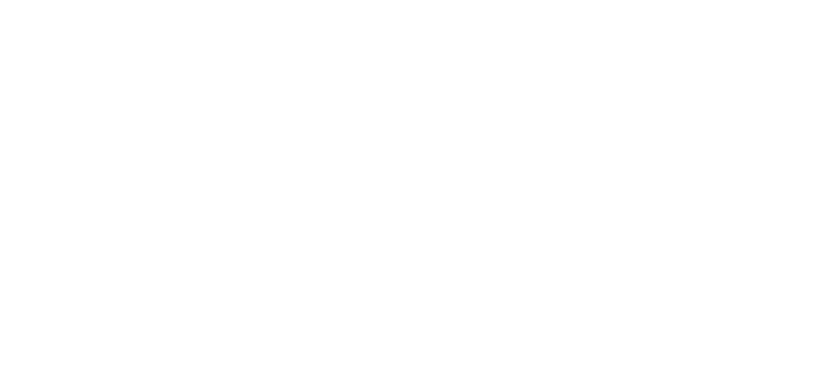
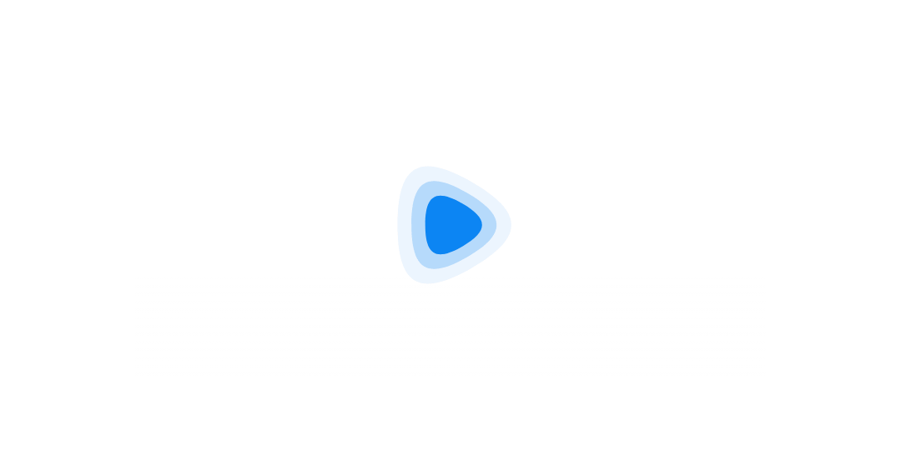

# Remotion Brand Assets

This repo includes the logo, logo with title, and a social preview image (when posting on social media).

## Animated logo (light mode)

## Animated logo (dark mode)

## With title (light mode)

## With title (dark mode)

## Without title (light mode)

## Without title (dark mode)

</img>

## Social preview image

## SVG logo (light mode)

## SVG logo (dark mode)

## Recorder animated (light mode)

## Recorder animated (dark mode)

